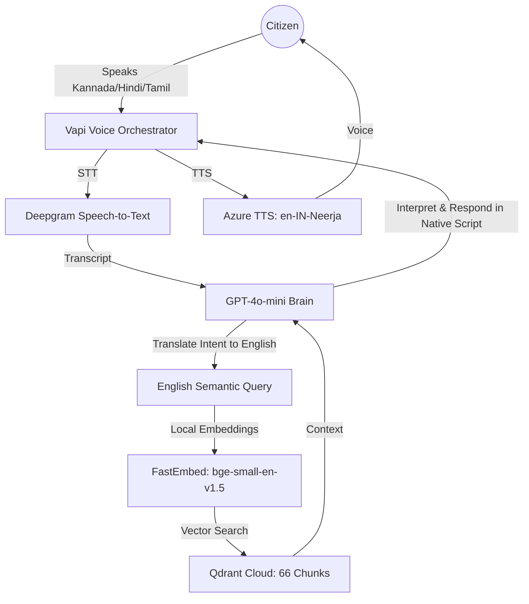

# SahayakSetu (सहायक सेतु) 🚀
### Bridging the Gap between Indian Citizens and Government Welfare through Voice.

[](https://sahayak-setu.vercel.app)
[](#)
[](#)

**SahayakSetu** is a production-ready, multilingual voice-first AI agent designed for **inclusive digital public infrastructure**. It empowers non-tech-savvy and low-literacy populations across India to access, understand, and act on government schemes in their **mother tongue**.

---

## 🏛️ Architecture: The Translation-RAG Pipeline
To solve the memory constraints of hosting on lightweight cloud instances while maintaining support for 50+ regional languages, we implemented an innovative **Translation-Aware RAG Architecture**.



---

## 🎯 Hackathon Challenge: Accessibility & Impact
SahayakSetu directly addresses **Hackblr Challenge #3**. Most government portals are text-heavy barriers; we turned them into a empathetic conversation.

### 1. Breaking the Linguistic Divide
- **Innovation**: Instead of using heavy multilingual embedding models that crash on 512MB RAM, we use a **Translation-Aware Logic**. The LLM acts as the bridge, allowing us to use ultra-lightweight (70MB) embeddings to search 7+ regional languages accurately.
- **Coverage**: English, Hindi, Kannada, Tamil, Telugu, Bengali, Hinglish.

### 2. Zero-Cost RAG Scaling
- **Innovation**: By utilizing **FastEmbed** for local vector generation, we've eliminated all external embedding API costs. This makes SahayakSetu infinitely scalable for the government to deploy without recurring API taxes.

### 3. Actionable Welfare Access
- We don't just "talk"; we guide. The AI is hardcoded to provide **Summary → Eligibility → Actionable Next Steps** (e.g., "Visit the nearest CSC with your Aadhaar").

---

## 🛠️ Technology Stack
| Layer | Technology |
| :--- | :--- |
| **Voice / STT / TTS** | [Vapi.ai](https://vapi.ai) with Deepgram & Azure Neural Voices |
| **Intelligence** | GPT-4o-mini (Optimized for low-latency & high reasoning) |
| **Vector Database** | [Qdrant Cloud](https://qdrant.tech/) |
| **Embedding Engine** | **FastEmbed** (Local, 70MB Memory-Safe Brain) |
| **Backend** | FastAPI (Python 3.12) |
| **Frontend** | Vanilla JS + Glassmorphism CSS |
| **Hosting** | Vercel (Frontend) & Render (Backend) |

---

## 🚀 Impact & Vision
SahayakSetu ensures that government schemes like **PM-Kisan, Ayushman Bharat, and Gruha Lakshmi** reach the "Last Mile." By removing the need for high-end hardware or expensive APIs, we’ve created a blueprint for **frugal innovation in AI for Social Good**.

---

## 🛠️ Local Setup & Development

1. **Clone & Install Dependencies**
   ```bash
   git clone https://github.com/bansalbhunesh/SahayakSetu.git
   cd SahayakSetu
   pip install -r backend/requirements.txt
   ```

2. **Environment Configuration**
   Create a `.env` in the root (or `backend/`) with:
   - `OPENAI_API_KEY`
   - `QDRANT_URL` & `QDRANT_API_KEY`
   - `VAPI_API_KEY`

3. **Ingest the Knowledge Base**
   ```bash
   python scripts/ingest.py
   ```

4. **Launch the Server**
   ```bash
   python -m uvicorn backend.main:app --reload
   ```

---
*Built for Hackblr 2026 — Supporting Bangalore's All-India Hackathon Spirit.* 🇮🇳
